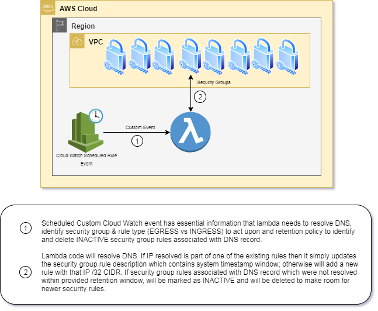

# DNS Resolver Lambda
   For security and compliance reasons, you may not be allowed to create INGRESS or EGRESS rules to 0.0.0.0/0 for specific port. Specific to EGRESS rule - If your 
   dependency services are internet facing then you can't simply put current public IP their DNS records on security groups because it may change at any time and when 
   that happens, your system will not able to communicate with the dependency service.    

   DNS resolver lambda solves this problem. This lambda code is designed to resolve any DNS to its IP and add appropriate security group rule in that regards. While this 
   may sound simple, this approach comes with some native challenges due to few limitations imposed by AWS itself.

## Challenges
1. At the time of writing this document, Security Group can have up to 60 inbound and up to 60 outbound rules. If lambda code is designed to just add new security group rule 
   then at some point in future, it would hit this threshold and solution would stop working. For seemless solution, it is important to identify the inactive security group 
   rules in relation to source DNS record and remove them on timely basis to make a room for new security group rules.
    
2. At the time of writing this document, Only up to 5 security groups can be attached to EC2 server. Solution should NOT assume performing security group rules changes on
   dedicated security group. It should identify relevant security group rules associated with source DSN record.

## Build & Setup
   This java 8 based component is developed using Spring Cloud Framework which provides easy abstraction of business logic without having to worry about Cloud Provider 
   specific implementation.
   
   To build this, Simply clone the Git repository and execute below maven command to trigger the build process.
   
   > $ mvn clean package  
   
   If you don't want to build then grab the binary files from the release section and upload it your lambda.
   
   This lambda code requires you to setup Environment variable `FUNCTION_NAME` = `DnsResolverFunction` to function properly.
   
## Architecture
  Solution of this stack involves use of Cloud Watch Rule as `Scheduled Event` to trigger lambda code, however Cloud Watch Schedule Event shouldn't be passed to the lambda. 

Lambda is developed to receive specific custom event which involves following details. Configuring data as part of custom event allows reuse of the lambda for various different DNS records. User is only expected to setup new Cloud Watch rule for new DNS record.

  
|  Sr No   | Field Name            | Required | Default Value | Comments
|:---------|:----------------------|:---------|:-----------|:---------------------------------------------------------------------------|
|	1      | securityGroupId       | Yes      | -          | Security Group Id                                                          |
|	2      | dnsRecord             | Yes      | -          | Source DNS record for which IP address is required to resolved             |
|	3      | rule                  | No       | EGRESS     | Type of Rule. Valid values are 'EGRESS' and 'INGRESS'                      |
|	4      | rulePort              | No       | 443        | Port No                                                                    |
|	5      | ruleDescriptionPrefix | Yes      | -          | Used as rule filter criteria so this has be unique on security group. |
|	6      | purgeSgRuleCutOff     | No       | 1440       | In Minutes. Derives how long INACTIVE record can live before it gets deleted.            |
	

Once Custom Event is recieved by Lambda, the very first it does is to verify its correctness. If it is not valid, it will error out.
Once input data is verified, it resolves the IP address of DNS record provided in the request. It then pulls all of the security group rules of target rule type and filters them using rule description prefix to narrow down the scope of the rules. If resolved IP address is listed as source or destination whichever is valid in the context of rule type, it updates the rule description of corroponding rule. 
Rule description is important element to identify & remove INACTIVE security group rule. Security rule description on security group is derived using security rule description prefix provided in the request and systems current date time value. Example - if security rule description prefix in the request is `Code Deploy US-EAST-2` and system current date time is `2019-10-27T21:23:44.847` then security rule description would be `Code Deploy US-EAST-2 - [2019-10-27T21:23:44.847]`. System date time value indicates when was the last time this IP address was resolved for source DNS. If this value is older than 24 hours (1440 minute) then chances of resolving DNS to this IP in near future are very slim so can be considered as INACTIVE records. Security group rule is considered as INACTIVE if this value is older than `(System current date time - purgeSgRuleCutOff (in minutes))` and can then be safely removed.

If resolve IP address is not part of current security group rule then lambda adds new rule with the rule description in the format as stated in above.

### Examples 
1. Custom event # 1
   As fields `rule`, `rulePort` and `purgeSgRuleCutOff` are not passed, they will considered as `EGRESS`, `443`, `1440` by lambda.
   
        {
          "securityGroupId": "sg-04f7feaeaf7908a53",
          "dnsRecord": "codedeploy.us-east-2.amazonaws.com",
          "ruleDescriptionPrefix": "Code Deploy US-EAST-2"
        }

2. Custom event # 2
   As field `rule` is not passed, it will be considered as `EGRESS` by lambda.
   
        {
          "securityGroupId": "sg-04f7feaeaf7908a53",
          "dnsRecord": "codedeploy.us-east-2.amazonaws.com",
          "rulePort" : 80,
          "ruleDescriptionPrefix": "Code Deploy US-EAST-2",
          "purgeSgRuleCutOff": 2880
        }

## IAM policy requirement of Lambda execution role
  Lambda is not required to be executed in the VPC. Modify this IAM policy to fit into your security requirements.
  
        {
          "Version": "2012-10-17",
          "Statement": [
              {
                  "Effect": "Allow",
                  "Action": [
                      "ec2:CreateNetworkInterface",
                      "ec2:DeleteNetworkInterface",
                      "ec2:DescribeNetworkInterfaces",
                      "ec2:DescribeSecurityGroups",
                      "logs:CreateLogGroup",
                      "logs:CreateLogStream",
                      "logs:PutLogEvents",
                      "ec2:AuthorizeSecurityGroupEgress",
                      "ec2:AuthorizeSecurityGroupIngress",
                      "ec2:RevokeSecurityGroupEgress",
                      "ec2:RevokeSecurityGroupIngress",
                      "ec2:UpdateSecurityGroupRuleDescriptionsEgress",
                      "ec2:UpdateSecurityGroupRuleDescriptionsIngress"                      
                  ],
                  "Resource": "*"
              }
          ]
      }

## Important points to note
1. Prior to implementing system consuming security group which has dynamic ip requirement, ensure that lambda has executed long enough to have stable set of IP addresses on the security group.
2. Schedule lambda to execute more often so security groups stays up to date with changing public ip address for DNS record. Lambda is enforced to flush DNS cache after 1 minute so it would always hit the DNS server to resolve the IP address if scheduled to run after every 2 minutes or more.
3. This write up doesn't mention of Cloud Watch Alarm on lambda failure etc. but it is recommended to follow best practices of  monitoring solution which allows you to alert whenever action is required.
